# PayQuick Frontend Architecture

> Frontend system design for a secure money transfer application (web)

## Table of Contents

- [Overview](#overview)
- [Architecture Diagram](#architecture-diagram)
- [Layer Breakdown](#layer-breakdown)
- [Data Flow](#data-flow)
- [State Management Strategy](#state-management-strategy)
- [API Communication Layer](#api-communication-layer)
- [Authentication & Security](#authentication--security)
- [Real-time Notifications](#real-time-notifications)
- [Testing Strategy](#testing-strategy)
- [Key Decisions & Trade-offs](#key-decisions--trade-offs)

---

## Overview

PayQuick's frontend architecture follows a **layered, feature-based structure** optimized for:

- **Security**: Critical for financial applications
- **Maintainability**: Clear separation of concerns
- **Scalability**: Easy to add new features without touching existing code
- **Testability**: Each layer can be tested in isolation

### Tech Stack

| Concern        | Choice                     | Rationale                                                      |
| -------------- | -------------------------- | -------------------------------------------------------------- |
| Framework      | Next.js (App Router)       | SSR for security-sensitive pages, API routes for BFF pattern   |
| Language       | TypeScript                 | Type safety critical for financial data                        |
| State (Server) | TanStack Query             | Caching, background refetch, optimistic updates                |
| State (Client) | React Context + useReducer | Lightweight, sufficient for auth/UI state                      |
| Styling        | Tailwind CSS + shadcn/ui   | Rapid development, consistent design system                    |
| Forms          | React Hook Form + Zod      | Performant validation, type-safe schemas                       |
| HTTP Client    | Native fetch               | Next.js caching, BFF wrapper handles auth refresh              |
| E2E Testing    | Playwright                 | Cross-browser testing, reliable selectors, built-in assertions |
| Unit Testing   | Vitest + Testing Library   | Fast, ESM-native, React component testing                      |

---

## Architecture Diagram

```mermaid
flowchart TB
    subgraph Presentation["PRESENTATION LAYER"]
        direction TB
        subgraph Pages[" "]
            direction TB
            P1["Login<br/>Page"]
            P2["Dashboard<br/>Page"]
            P3["Send $<br/>Page"]
            P4["Transactions<br/>Page"]
            P5["Accounts<br/>Page"]
        end

        Pages --> Features

        subgraph Features["Feature Components"]
            F1["LoginForm, TransactionList, SendMoneyForm"]
            F2["AccountList, ConnectAccountModal"]
        end

        Features --> UIKit

        subgraph UIKit["UI Components · shadcn/ui"]
            U1["Button, Input, Card, Dialog, Toast, DataTable"]
        end
    end

    Presentation --> State

    subgraph State["STATE LAYER"]
        direction TB
        S1["Auth Context<br/>─────────<br/>• user<br/>• tokens<br/>• isAuth"]

        subgraph TanStack["TanStack Query"]
            direction TB
            subgraph TSQueries["Queries"]
                direction LR
                TQ1["transactions"]
                TQ2["accounts"]
                TQ3["profile"]
                TQ4["notifications"]
            end
            subgraph TSMutations["Mutations"]
                direction LR
                TM1["useLogin<br/>useLogout"]
                TM2["useSendMoney"]
                TM3["useConnectAccount<br/>useDisconnectAccount"]
                TM4["useUpdateProfile"]
                TM5["useMarkAsRead<br/>useMarkAllAsRead"]
            end
        end

        S3["Local State<br/>─────────<br/>• form data<br/>• UI toggles<br/>• loading"]
    end

    State --> Services

    subgraph Services["SERVICE LAYER"]
        direction TB
        subgraph APIClient["API Client · fetch"]
            direction LR
            R1["Request<br/>Interceptor<br/>(add auth)"]
            R2["Response<br/>Interceptor<br/>(transform)"]
            R3["Token Refresh<br/>Interceptor<br/>(401 → refresh)"]
            R1 --- R2 --- R3
        end

        subgraph Realtime["Real-time Services"]
            direction LR
            WS["WebSocket<br/>(in-app)"]
            Push["Web Push<br/>(Service Worker)"]
        end
    end

    Services --> Security

    subgraph Security["SECURITY LAYER"]
        direction TB
        Sec1["• httpOnly Cookies<br/>• Route Guards<br/>• CSP Headers"]
        Sec2["• CSRF Tokens<br/>• Input Sanitization<br/>• Rate Limiting"]
    end

    Security --> Backend
    Push -.-> PushServer

    Backend[("Backend API<br/>(REST + WebSocket)")]
    PushServer[/"Push Server<br/>(FCM/APNs)"/]
```



---

## Layer Breakdown

### 1. Presentation Layer

```
app/
├── (auth)/                    # Auth route group (public)
│   ├── login/page.tsx
│   └── register/page.tsx
├── (protected)/               # Protected route group
│   ├── layout.tsx             # Auth guard wrapper
│   ├── dashboard/page.tsx
│   ├── transactions/
│   │   ├── page.tsx           # List view
│   │   └── [id]/page.tsx      # Detail view
│   ├── send/page.tsx
│   └── settings/
│       ├── profile/page.tsx
│       └── accounts/page.tsx
└── layout.tsx                 # Root layout (providers)

components/
├── ui/                        # shadcn/ui primitives
├── features/                  # Feature-specific components
│   ├── auth/
│   ├── transactions/
│   ├── send/
│   └── accounts/              # AccountList, ConnectAccountModal
└── shared/                    # Cross-feature components
```

**Principles:**

- **Colocation**: Feature components live with their pages
- **Composition**: Complex UIs built from small, focused components
- **Separation**: UI components have no business logic

### 2. State Layer

| State Type   | Tool                | Scope           | Example                    |
| ------------ | ------------------- | --------------- | -------------------------- |
| Server State | TanStack Query      | Global (cached) | Transactions, user profile |
| Auth State   | React Context       | Global          | Current user, tokens       |
| UI State     | useState/useReducer | Local           | Form inputs, modal open    |
| URL State    | Next.js Router      | Global          | Filters, pagination        |

**Why this split?**

- Server state has different concerns (caching, staleness, refetching)
- Auth state needs to be accessible everywhere but rarely changes
- UI state is ephemeral and component-specific

### 3. Service Layer

```
lib/
├── api/
│   ├── client.ts              # Fetch wrapper + auth handling
│   ├── types.ts               # API response types
│   └── endpoints.ts           # Endpoint constants
└── services/
    ├── auth.service.ts        # login, logout, refresh, register
    ├── transaction.service.ts # getAll, getById, create
    ├── account.service.ts     # link, unlink, getLinked
    └── user.service.ts        # getProfile, updateProfile
```

**Key Responsibilities:**

- Centralized API client with base configuration
- Request interceptors for attaching auth headers and CSRF tokens
- Response interceptors for handling 401 errors and triggering token refresh
- Standardized error transformation

### 4. Security Layer

See [Authentication & Security](#authentication--security) section.

---

## Data Flow

### Unidirectional Data Flow

```
User Action → Event Handler → Service Call → State Update → Re-render
     │                                              │
     └──────────────────────────────────────────────┘
                    (UI reflects state)
```

### Example: Send Money Flow


---

## State Management Strategy

### Auth Context

Manages authentication state globally:

- **State**: `user`, `isAuthenticated`, `isLoading`
- **Actions**: `LOGIN_SUCCESS`, `LOGOUT`, `SET_LOADING`
- **Methods**: `login()`, `logout()`

### Server State (TanStack Query)

Configuration approach for data fetching:

- **Stale time**: 30 seconds (data considered fresh)
- **Cache time**: 5 minutes (data kept in memory)
- **Background refetch**: On window focus and reconnect
- **Prefetching**: Next page prefetched for pagination

#### TanStack Queries

| Domain        | Query Key                | Service Function        | Endpoint                  |
| ------------- | ------------------------ | ----------------------- | ------------------------- |
| Transactions  | `['transactions', page]` | `getTransactions(page)` | `GET /transactions?page=` |
| Accounts      | `['accounts']`           | `getAccounts()`         | `GET /accounts`           |
| Profile       | `['profile']`            | `getProfile()`          | `GET /users/me`           |
| Notifications | `['notifications']`      | `getNotifications()`    | `GET /notifications`      |

#### TanStack Mutations

| Domain        | Hook                   | Service Function        | Endpoint                        | Invalidates         |
| ------------- | ---------------------- | ----------------------- | ------------------------------- | ------------------- |
| Auth          | `useLogin`             | `login(credentials)`    | `POST /login`                   | —                   |
| Auth          | `useLogout`            | `logout()`              | `POST /logout`                  | All queries         |
| Transactions  | `useSendMoney`         | `sendMoney(data)`       | `POST /transactions`            | `['transactions']`  |
| Accounts      | `useConnectAccount`    | `connectAccount(data)`  | `POST /accounts/connect`        | `['accounts']`      |
| Accounts      | `useDisconnectAccount` | `disconnectAccount(id)` | `DELETE /accounts/:id`          | `['accounts']`      |
| Profile       | `useUpdateProfile`     | `updateProfile(data)`   | `PATCH /users/me`               | `['profile']`       |
| Notifications | `useMarkAsRead`        | `markAsRead(id)`        | `PATCH /notifications/:id`      | `['notifications']` |
| Notifications | `useMarkAllAsRead`     | `markAllAsRead()`       | `PATCH /notifications/read-all` | `['notifications']` |

---

## API Communication Layer

### Service Structure

```
lib/
├── api/
│   ├── client.ts              # Fetch wrapper + auth handling
│   ├── types.ts               # API response types
│   └── endpoints.ts           # Endpoint constants
└── services/
    ├── auth.service.ts        # login, logout, refresh, register
    ├── transaction.service.ts # getAll, getById, create
    ├── account.service.ts     # link, unlink, getLinked
    └── user.service.ts        # getProfile, updateProfile
```

### Request/Response Pattern

Standardized API response structure:

- `status`: "success" | "error"
- `message`: Human-readable message
- `data`: Response payload (generic type)
- `pagination`: Optional pagination metadata

### Error Handling Strategy

- Custom `ApiError` class with status, code, and message
- Global interceptor catches errors and transforms them
- Server errors (5xx) trigger user-visible toast notifications
- Client errors (4xx) handled by individual components

---

## Authentication & Security

### Token Strategy

```
┌─────────────────────────────────────────────────────────────┐
│                    Token Architecture                        │
├─────────────────────────────────────────────────────────────┤
│                                                             │
│   Access Token                    Refresh Token             │
│   ┌─────────────────┐            ┌─────────────────┐       │
│   │ httpOnly cookie │            │ httpOnly cookie │       │
│   │ Secure          │            │ Secure          │       │
│   │ SameSite=Strict │            │ SameSite=Strict │       │
│   │ Max-Age=900     │            │ Max-Age=604800  │       │
│   │ (15 min)        │            │ (7 days)        │       │
│   └─────────────────┘            └─────────────────┘       │
│                                                             │
│   - Not accessible via JS (XSS protection)                 │
│   - Not sent to other domains (CSRF protection)            │
│   - Encrypted in transit (HTTPS only)                      │
│                                                             │
└─────────────────────────────────────────────────────────────┘
```

### Token Refresh Flow


### Security Measures

| Threat           | Mitigation                                                                       |
| ---------------- | -------------------------------------------------------------------------------- |
| **XSS**          | httpOnly cookies, CSP headers, React's auto-escaping, DOMPurify for user content |
| **CSRF**         | SameSite=Strict cookies, CSRF tokens for mutations                               |
| **Token Theft**  | Short-lived access tokens, refresh token rotation                                |
| **Injection**    | Zod validation, parameterized queries (backend)                                  |
| **Clickjacking** | X-Frame-Options header, frame-ancestors CSP                                      |

### MFA Approach

- Login response indicates if MFA is required
- Temporary MFA token issued for verification step
- User redirected to MFA verification page
- Upon successful verification, full auth tokens issued

### Route Protection

- Server-side session check in protected layout
- Automatic redirect to login if unauthenticated
- Auth provider initialized with session user data

---

## Real-time Notifications

### Two Notification Channels

| Channel       | When            | Technology            | UI                  |
| ------------- | --------------- | --------------------- | ------------------- |
| **WebSocket** | User on website | Persistent connection | In-app toast, badge |
| **Web Push**  | User away       | Service Worker + FCM  | OS notification     |

### Architecture

```mermaid
flowchart TB
    subgraph Backend["Backend"]
        Event["New Notification Created"]
    end

    Event --> WS
    Event --> PushSvc

    subgraph WebSocket["WebSocket (User on site)"]
        WS["Push via WebSocket"] --> Cache["Update TanStack Cache"]
        Cache --> Toast["Show Toast 🔔"]
        Cache --> Badge["Update Badge Count"]
    end

    subgraph WebPush["Web Push (User away)"]
        PushSvc["Send to FCM/APNs"] --> SW["Service Worker"]
        SW --> OSNotif["OS Notification 🔔"]
        OSNotif --> Click["Click → Open App"]
    end
```



### WebSocket Behavior (In-App)

- Connection established on authenticated pages
- Incoming messages update TanStack Query cache via `setQueryData` or `invalidateQueries`
- In-app toast notifications for immediate feedback
- Automatic reconnection with exponential backoff
- Cleanup on component unmount

### Web Push Behavior (Background)

- User subscribes once (permission prompt)
- Subscription stored in backend
- Service Worker runs in background, even when site is closed
- FCM/APNs delivers push to user's browser
- Click on notification opens the app at relevant page

---

## Testing Strategy

### Testing Pyramid

```
        ┌───────────┐
        │   E2E     │  ← Few, slow, high confidence
        │(Playwright)│
        ├───────────┤
        │Integration│  ← API mocking, component integration
        │ (Vitest)  │
        ├───────────┤
        │   Unit    │  ← Many, fast, isolated
        │ (Vitest)  │
        └───────────┘
```

### Test Types by Layer

| Layer              | Test Type   | Tool                     | What to test                          |
| ------------------ | ----------- | ------------------------ | ------------------------------------- |
| UI Components      | Unit        | Vitest + Testing Library | Rendering, props, accessibility       |
| Feature Components | Integration | Vitest + MSW             | User interactions, API integration    |
| Services           | Unit        | Vitest                   | API calls, error handling, transforms |
| Hooks              | Unit        | Vitest + renderHook      | State changes, side effects           |
| Full Flows         | E2E         | Playwright               | Login, send money, transactions       |

### E2E Test Coverage (Playwright)

| Flow              | What it tests                                 |
| ----------------- | --------------------------------------------- |
| **Auth**          | Login, logout, token refresh, session expiry  |
| **Transactions**  | View list, pagination, filter by month        |
| **Send Money**    | Form validation, success flow, error handling |
| **Accounts**      | Connect account, disconnect, list accounts    |
| **Notifications** | Badge count, mark as read                     |

### Folder Structure

```
tests/
├── e2e/                       # Playwright E2E tests
│   ├── auth.spec.ts
│   ├── transactions.spec.ts
│   ├── send-money.spec.ts
│   └── accounts.spec.ts
├── integration/               # Component + API integration
│   └── features/
└── unit/                      # Pure unit tests
    ├── components/
    ├── hooks/
    └── services/
```

### E2E Best Practices

- **Use data-testid** for reliable selectors
- **Mock external services** (payment providers, push notifications)
- **Test critical paths first** (login → send money → verify transaction)
- **Run in CI** on every PR
- **Visual regression** for UI-sensitive components

---

## Key Decisions & Trade-offs

### 1. Next.js vs React + Vite (SPA)

| Decision        | Next.js                                                                                       |
| --------------- | --------------------------------------------------------------------------------------------- |
| **Why**         | SSR/SSG for sensitive pages, Server Components, built-in API routes, file-based routing       |
| **Trade-off**   | More opinionated, server infrastructure required, some client libraries need adaptation       |
| **Alternative** | React + Vite (simpler setup, fully client-side, but no SSR security benefits, manual routing) |

### 2. httpOnly Cookies vs localStorage

| Decision        | httpOnly Cookies                                                       |
| --------------- | ---------------------------------------------------------------------- |
| **Why**         | Immune to XSS - JavaScript cannot access tokens                        |
| **Trade-off**   | More complex setup, need CSRF protection, requires server coordination |
| **Alternative** | localStorage (simpler, but vulnerable to XSS)                          |

### 3. TanStack Query vs Redux / Zustand

| Decision        | TanStack Query for server state                                     |
| --------------- | ------------------------------------------------------------------- |
| **Why**         | Purpose-built for async data: caching, deduping, background refetch |
| **Trade-off**   | Another library to learn, overkill for simple apps                  |
| **Alternative** | Redux Toolkit Query (if already using Redux), SWR (lighter)         |

### 4. Feature-based vs Type-based Folder Structure

| Decision        | Feature-based                                                                |
| --------------- | ---------------------------------------------------------------------------- |
| **Why**         | Colocation - related code together, easier to find, better for scaling teams |
| **Trade-off**   | Can lead to duplication if features share a lot                              |
| **Alternative** | Type-based (`components/`, `hooks/`, `services/`) - simpler for small apps   |

### 5. Tailwind + shadcn/ui vs CSS-in-JS / Component Library

| Decision        | Tailwind + shadcn/ui                                           |
| --------------- | -------------------------------------------------------------- |
| **Why**         | Zero runtime CSS, full control over components, great DX       |
| **Trade-off**   | Verbose class names, need to build some components yourself    |
| **Alternative** | Chakra UI (faster to start), styled-components (more flexible) |

### 6. Form Handling: React Hook Form vs Controlled Components

| Decision        | React Hook Form + Zod                                              |
| --------------- | ------------------------------------------------------------------ |
| **Why**         | Uncontrolled inputs = fewer re-renders, Zod = type-safe validation |
| **Trade-off**   | Additional dependencies, learning curve                            |
| **Alternative** | Controlled components (simpler, but performance cost at scale)     |
